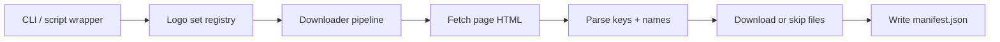

# Design Notes

This document explains the current design choices behind the Serebii logo downloader.

## Goals

The current design optimizes for:

- adding more Serebii logo sets without cloning scripts
- keeping downloaded assets checked into the repo
- making reruns cheap and deterministic
- keeping the scraping rules explicit per source page

## Non-Goals

The current implementation does not try to be:

- a general-purpose web crawler
- a packaged data API
- a test-heavy framework
- a background sync system

## High-Level Architecture

## Why a Registry-Based Design

The core design decision is to treat each Serebii page as a named logo set with explicit scrape metadata.

That is why `LogoSetDefinition` includes:

- `set_id`
- `page_url`
- `asset_url_template`
- output paths
- selector configuration

This keeps source-specific assumptions out of the shared download pipeline. When a new page follows the same basic pattern, adding support should mostly be data entry instead of new code.

## Why CSS Selectors Instead of Page-Specific Parsers

Serebii pages often follow a repeated HTML pattern, but not always with the same path or labels. The current design uses selectors and attributes as the extension point because:

- they are simpler than per-page parser classes
- they make assumptions visible in one place
- they are enough for the current `pokemon30` page

If future pages diverge too much, the next step would be to let a set definition inject a custom parser function instead of relying only on selectors.

## Why Keep the Downloader Generic

The old one-off implementation coupled:

- one page
- one output directory
- one script

The current design splits those apart:

- CLI chooses a set
- registry defines the set
- downloader executes the same pipeline for every set

That reduces duplicated code and makes the repo structure stable as more sets are added.

## Why Keep Compatibility Wrappers

The repo still includes `scripts/download_pokemon30_logos.py` because the original one-set workflow is still useful and may already be referenced elsewhere.

Compatibility wrappers are cheap and keep the refactor low-risk:

- no logic duplication
- no special case in the downloader
- no need to relearn the old command immediately

## Data and Manifest Design

The design treats downloaded files as first-class repo artifacts, not cache.

That is why:

- assets live under `data/<set_id>/logos/`
- each run rewrites `manifest.json`
- the manifest includes hashes and byte counts

The hash and size fields give lightweight integrity information without needing a second database or metadata service.

## Concurrency Model

Downloads use a thread pool because the workload is network-bound and simple:

- each asset download is independent
- requests spends most of its time waiting on I/O
- thread-local sessions avoid sharing a mutable session object across worker threads

The implementation is intentionally conservative:

- one page fetch up front
- parallel file downloads after parsing
- retries on transient HTTP failures

## Idempotency and Reruns

Reruns are designed to be safe:

- existing files are skipped unless `--force` is set
- manifest output is regenerated each time
- deduplication by key prevents double-downloading repeated page entries

This is a practical compromise. The current design favors stable reruns over aggressive cleanup or change detection.

## Extension Model

The intended extension path is:

1. inspect a new Serebii page
2. determine the key source, label source, and asset URL shape
3. register a new `LogoSetDefinition`
4. download into `data/<set_id>/`

If that model stops being sufficient, the likely next design changes are:

- custom parser hooks per set
- per-set file extensions
- stale-file pruning
- tests with frozen HTML fixtures

## Current Risks

The main risks in the current design are upstream HTML changes:

- selector changes can silently reduce asset discovery
- changed asset naming conventions could break URL construction
- non-PNG assets would not fit the current filename model cleanly

The current mitigation is to keep the design simple and the manifest explicit so breakage is easy to inspect after a run.
